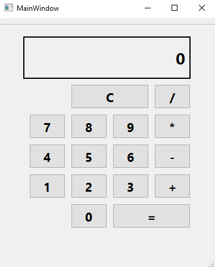

## Portfolio
 

I am currently a senior at Seattle Pacific University pursuing a B.S. in Computer Science and a B.A. in Honors Liberal Arts. Expected Graduation Date: June 2021.

---

### Internship Work

LightSys Technology Services. August 2020-January 2021

 

Greater detail found on my LinkedIn

---

### Class Projects 

[Basic Qt Calculator](https://github.com/cscederborg/basicQtCalculator)
 

---
[Ruby Parser](https://github.com/cscederborg/rubyParser)
 

Lexical and Syntactical Analyzer for a given Grammar

---
[Prolog Cartesian Points](https://github.com/cscederborg/prologThreePoints)
 

Receives input from Ruby Parser and checks the attributes of the Points

---
[Scheme Angle Calculation](https://github.com/cscederborg/schemeThreePoints)
 

Receives input from Ruby Parser and calculates the angles of triangles made by the points

---
[Hash Table Text Analyzer](https://github.com/cscederborg/hashTextAnalyzer)
 

Program to analyze total number of each word of each letter using a hash function

---

Page template forked from <a href="https://github.com/evanca/quick-portfolio">evanca</a>

<!-- Remove above link if you don't want to attibute -->
